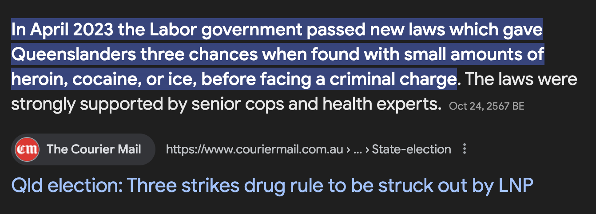

Recently, I saw this headline. As the CFMEU says, 'is it true? or did you read it in the Courier Mail?', but either way, I hypothesised what I think is an interesting thought experiment.

The 3 strike rule was a policy previously introduced by the Queensland Government where individuals who are caught with a small amount of illicit substances, including cocaine, heroin, and methamphetamine are given three chances before facing a criminal conviction (https://southerngoldcoastlawyers.com.au/new-queensland-legislation-three-strike-drug-offence/).

If the LNP does reform the 3 strike rule - when would be the last possible date I could carry illicit substances and not have to worry about legal ramifications (unless I had made the same mistake thrice).

By virtue of taking something away, you increase it's demand. If you tell me I won't be able to do something as easily as how I may currently do it, my immediate preference would be to keep things the way that they are. However, when factoring in the speed of bureaucracy - is there a window in which I can maximise my usage of an old system, before it can be changed?

This is called 'front running'. If you know an event is going to happen, you can take positions before and after to maximise your positions based on what may be happening.

I am unsure of the legislative procedures in my home state, I kinda get the vibe of it (https://www.youtube.com/watch?v=ssukL9a99JA), and am imagining that the LNP would have to give some kind of notice of reverting the law before it is officially recognised and enforced - I don't think that a new government can instantly revert laws, and if they can that's kind of shitty.

Hypothetically, lets say that when introduced to Parliament, it may take 2-4 weeks to pass the bill and revert the 3 strike law. Lets say the reversion is introduced December 1st, 2024. This would mean that I only have at max 2-4 weeks to do drugs in public until I cannot be prosecuted for it (as easily, anyway).

That wasn't a thought I'd had before, until I heard that these laws were being reverted.

With the speed of information being considerably faster than bereaucratic pocesses, if this is publicised enough, I believe that the reversion of the law may potentially have the exact opposite affect of what it is meant to have.

Early prediction: someones gonna make a 'Rack City' type facebook event page, where people are actively encouraged to go and do rack in King George Square while they still can and get off easily (legally speaking).

Rather than not thinking about doing drugs, I'm thinking about how long it is until I'm more easily branded a criminal.
